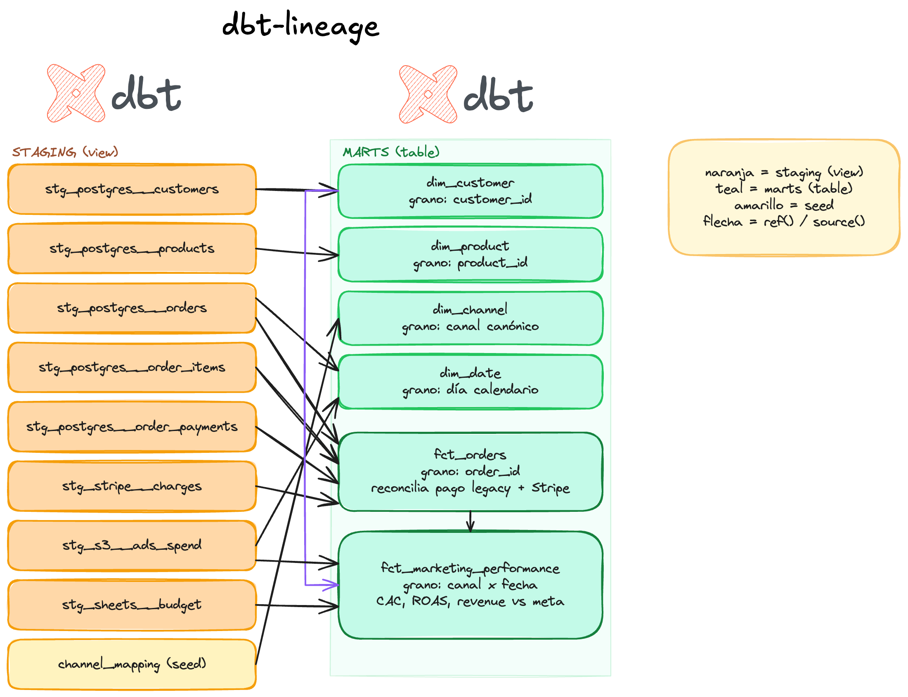
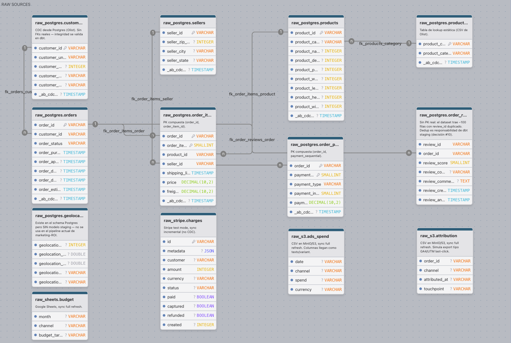
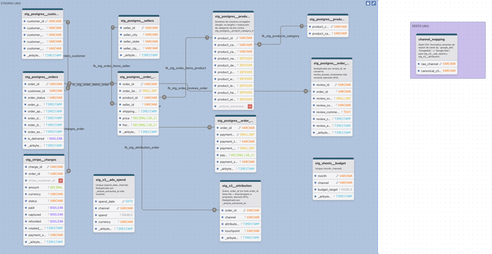
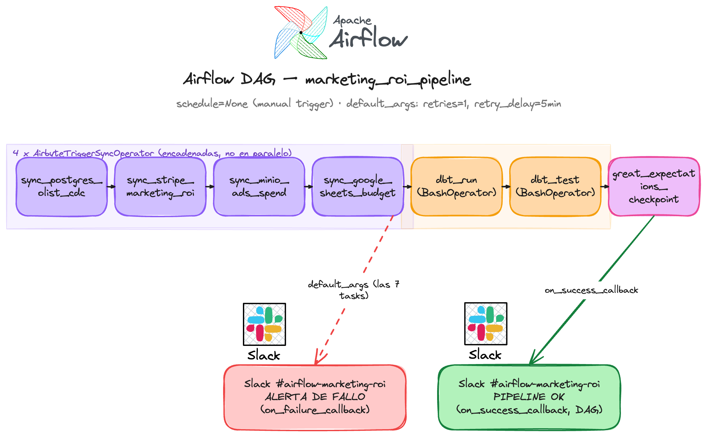

# Marketing ROI Pipeline

Proyecto de portafolio de data engineering: un pipeline de ingesta, transformación
y calidad de datos que responde, para un e-commerce, **"¿cuánto gastamos en
marketing por canal vs. cuánto revenue nos trae?"** (CAC, ROAS, revenue vs.
presupuesto).

El escenario combina deliberadamente cuatro fuentes heterogéneas para que el
trabajo de ingesta/CDC/reconciliación sea real y no trivial:

| Fuente | Rol |
| --- | --- |
| **Postgres** (dataset histórico Olist + generador sintético) | Núcleo transaccional; objetivo de CDC |
| **Stripe** (test mode) | Pagos "modernos" post-migración, enlazados a las órdenes de Postgres vía `metadata.order_id` |
| **S3 / MinIO** (CSVs sintéticos) | Gasto publicitario por canal y fecha |
| **Google Sheets** | Presupuesto de marketing objetivo por mes y canal |

Todo se orquesta con **Airflow**, se ingesta con **Airbyte OSS** hacia
**MotherDuck**, se transforma con **dbt**, se valida con **dbt tests +
Great Expectations**, y se consume desde **Power BI**.

## Arquitectura


```text
Postgres (CDC) ─┐
Stripe (incr)   ├─►  Airbyte OSS (4 conexiones)  ─►  MotherDuck  ─►  dbt  ─►  Power BI
S3 (full)       │        vía `abctl`, Destinations V2   (raw + typed)  (staging/marts)  (DirectQuery,
Sheets (full)  ─┘                                                                        endpoint Postgres)

                    Airflow (Docker Compose) orquesta:
              trigger syncs → dbt run → dbt test → checkpoint Great Expectations
```

Decisiones clave:

- Las 4 conexiones de Airbyte son **manual-trigger**: Airflow es la única fuente
  de verdad para el scheduling, no se depende del scheduler nativo de Airbyte.
- El conector de MotherDuck usa **Destinations V2**: dbt construye sobre las
  tablas tipadas finales, no sobre el JSON crudo de `airbyte_internal`.
- dbt corre vía `BashOperator` desde Airflow (no Cosmos), contra `dbt-duckdb`
  con un profile `md:`.
- La calidad es de dos capas: **dbt tests** (`not_null`, `unique`,
  `relationships`, `accepted_values`) para checks estructurales, y
  **Great Expectations** para rangos numéricos, distribuciones y freshness —
  ambas corren como tasks separadas en Airflow, así una falla de calidad
  bloquea que Power BI lea datos malos.

## Modelo de datos: raw → staging → marts



Grafo de dependencias `ref()`/`source()`: qué modelo de `staging` alimenta a
qué modelo de `marts`.

Los tres ERDs siguientes son el detalle columna-por-columna de cada capa
(generados con drawDB) — útiles para ver exactamente qué decisiones de
modelado (dedup, tipado, claves compuestas) pasan de raw a staging y de
staging a marts.

<details>
<summary><strong>Raw sources</strong> — tablas tal como llegan de Airbyte (Postgres CDC, Stripe, S3, Sheets)</summary>



Notas de la capa raw:

- `raw_postgres.order_reviews` no tiene PK real: el dataset trae ~100 filas
  con `review_id` duplicado — la dedup queda a cargo de staging.
- `raw_postgres.geolocation` existe en el schema de Postgres pero no tiene
  modelo de staging — no se usa en el pipeline actual de marketing-ROI.
- `raw_postgres.customers` no tiene FKs reales; la integridad referencial se
  valida en dbt (`relationships` tests), no en el schema de origen.

</details>

<details>
<summary><strong>Staging (dbt)</strong> — modelos <code>stg_*</code>, tipados y deduplicados</summary>



Decisiones de staging que valen la pena resaltar:

- `stg_postgres__order_reviews` deduplica por `review_id`, quedándose con el
  `review_answer_timestamp` más reciente.
- `stg_s3__ads_spend` es único por `(spend_date, channel)`, deduplicado por
  `_airbyte_extracted_at`.
- `stg_s3__attribution` tiene grano `order_id` (no todo `order_id` tiene fila
  — atribución directa/orgánica a propósito).
- El seed `channel_mapping` normaliza variantes de nombre de canal
  (`google_ads`, `GoogleAds` → `Google Ads`) usadas tanto por
  `stg_s3__ads_spend` como por `stg_s3__attribution`.

</details>

<details>
<summary><strong>Marts (dbt, star schema)</strong> — dimensiones y hechos consumidos por Power BI</summary>


- `fct_orders` reconcilia el pago legacy de Postgres con Stripe — cuando
  ambos existen para la misma orden no se suman (mismo cobro).
- `fct_marketing_performance` (grano canal × fecha) calcula
  `attributed_revenue`/`attributed_new_customers` como sumas/conteos reales
  vía atribución medida (`stg_s3__attribution`), no proporcional.
- `dim_channel` tiene grano de un canal canónico, derivado del seed
  `channel_mapping`.

</details>

## Orquestación con Airflow



El DAG `marketing_roi_pipeline` (`schedule=None`, trigger manual) encadena:
4× `AirbyteTriggerSyncOperator` (Postgres → Stripe → MinIO → Sheets, en
secuencia) → `dbt run` → `dbt test` → checkpoint de Great Expectations, con
alertas a Slack (`#airflow-marketing-roi`) en éxito y en fallo de cualquier
task.

## Estado del proyecto

**Fases 1-5 implementadas, dashboard de Power BI pendiente.** Postgres+CDC, las
4 conexiones de Airbyte hacia MotherDuck, el proyecto dbt de staging/marts y la
capa de calidad dbt-tests/Great Expectations están construidos y verificados.
La Fase 5 (orquestación con Airflow) corrió el DAG en verde de punta a punta.
Lo que falta es el dashboard de Power BI.

## Stack

Postgres · Stripe · S3/MinIO · Google Sheets → **Airbyte OSS** (`abctl`) →
**MotherDuck** → **dbt** (`dbt-duckdb`) → **Power BI**, orquestado por
**Apache Airflow** (Docker Compose), con calidad de datos vía **dbt tests** +
**Great Expectations** y alertas en **Slack**.

## Notas de desarrollo local

Levantar Airbyte contra el Postgres local requirió resolver dos problemas de
red no triviales (SSL deshabilitado a propósito entre contenedores en la
misma máquina, y un bug de resolución DNS de `host.docker.internal` en el
cluster `kind` de `abctl`) — diagnóstico y fix completos en
[ENGINEERING_NOTES.md](ENGINEERING_NOTES.md).

---

Nota: la documentación de diseño y planificación de este proyecto vive en `docs/`,
que está excluida del repo (`.gitignore`) por ser material de trabajo en progreso.
